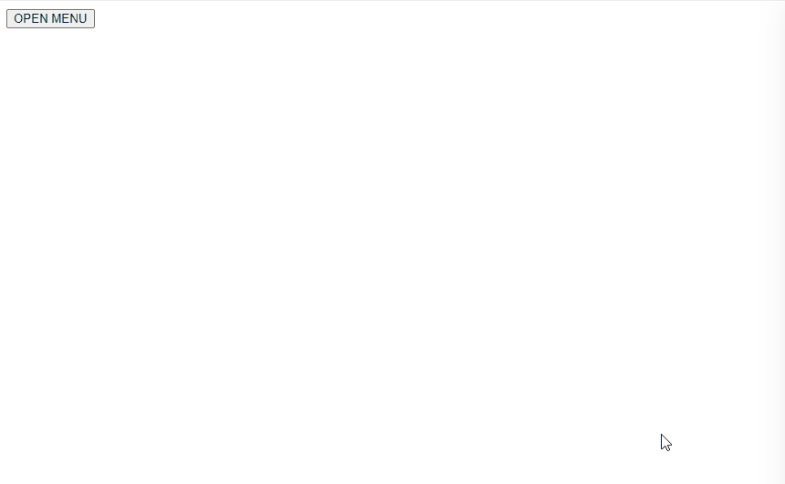

# 03-drawer

# Question

### 요구사항

- 다음 마크업을 가지고 와서 화면 예시를 보고 `app.js` 파일에 Drawer UI를 구현해주세요.

```html
<!DOCTYPE html>
<html lang="en">
  <head>
    <meta charset="UTF-8" />
    <meta http-equiv="X-UA-Compatible" content="IE=edge" />
    <meta name="viewport" content="width=device-width, initial-scale=1.0" />
    <title>drawer</title>
    <script defer src="js/app.js"></script>
  </head>
  <body>
    <!-- drawer -->
    <button id="drawer-opener">OPEN MENU</button>
    <div class="drawer">
      <h2>숨김메뉴</h2>
      <ul>
        <li>항목 1</li>
        <li>항목 2</li>
      </ul>
    </div>
  </body>
</html>
```

### 화면 예시



## 학습 포인트

- Javascript로 style 엘리먼트 컨트롤하기
- 생성자 함수에서 prototype 메서드 분리하기
